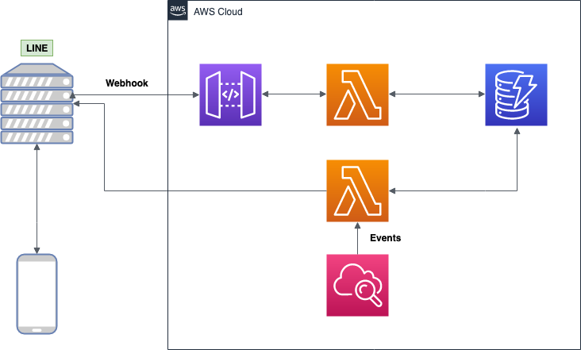

## ディレクトリ構成

    .
    ├── line-diary        # LINE Webhook URLに登録しているURLに紐づくlambda関数
    ├── line-notify       # Cloud Watch Eventsから叩かれるlambda関数
    ├── Makefile          
    └── template.yaml     # AWS SAM template file

## 構成図

